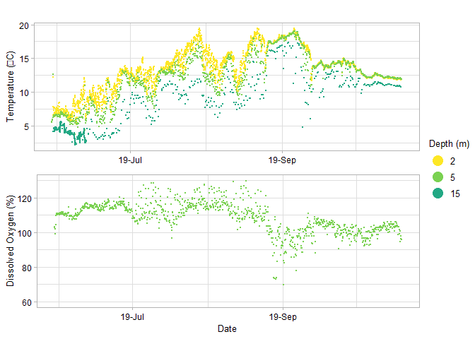
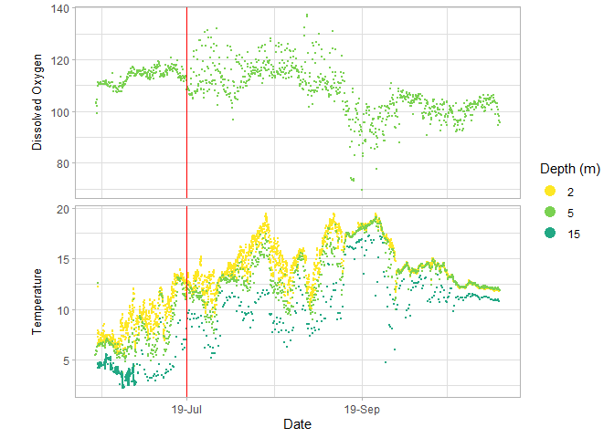

<!-- README.md is generated from README.Rmd. Please edit that file -->

# strings


<!-- badges: start -->

[](https://www.gnu.org/licenses/gpl-3.0)
[](https://github.com/centre-for-marine-applied-research/strings)
[](https://www.codefactor.io/repository/github/centre-for-marine-applied-research/strings)
[](https://github.com/centre-for-marine-applied-research/strings/actions)

<!-- badges: end -->

Compile, format, and visualize Water Quality (temperature, dissolved
oxygen, salinity) data measured by different sensors.

## Installation

You can install the development version of `strings` from
[GitHub](https://github.com/) with:

``` r
# install.packages("devtools")
devtools::install_github("Centre-for-Marine-Applied-Research/strings")
```

## Background

The Centre for Marine Applied Research ([CMAR](https://cmar.ca/))
coordinates an extensive [Coastal Monitoring
Program](https://cmar.ca/coastal-monitoring-program/) to measure
[Essential Ocean
Variables](https://www.goosocean.org/index.php?option=com_content&view=article&id=14&Itemid=114)
from around the coast of Nova Scotia, Canada. There are three main
branches of the program: *Water Quality*, *Currents*, and *Waves*.
Processed data for each branch can be viewed and downloaded from several
sources, as outlined in the [CMAR Report & Data Access Cheat
Sheet](https://github.com/Centre-for-Marine-Applied-Research/strings/blob/master/man/figures/README-access-cheatsheet.pdf)
(download for clickable links).

The `strings` package is used to compile, format, and visualize data
from the *Water Quality* branch of the Coastal Monitoring Program.

*Water Quality* data (temperature, dissolved oxygen, and salinity) is
collected using “sensor strings”. Each sensor string is attached to the
seafloor by an anchor and suspended by a sub-surface buoy, with
autonomous sensors attached at various depths (Figure 1). A string
typically includes three sensor models: Hobo, aquaMeasure, and VR2AR
(Table 1). Strings are deployed at a station for several months and data
are measured every 1 minute to 1 hour, depending on the sensor.


Figure 1: Typical sensor string configuration (not to scale).

<br>

After retrieval, data from each sensor is exported to a separate csv
file using manufacturer-specific software. Each type of sensor generates
a data file with unique columns and header fields, which poses a
significant challenge for compiling all data from a deployment into a
single format for analysis.

The `strings` package was originally built to address this challenge,
and now offers functions to compile, format, convert units, and
visualize sensor string data.

`strings` was developed specifically to streamline CMAR’s workflow, but
is flexible enough that other users can apply it to process data from
the accepted sensors (Table 1). Refer to the vignettes for more detail.

| Sensor (link to spec sheet)                                                                                                      | Variable(s) Measured          |
|:---------------------------------------------------------------------------------------------------------------------------------|:------------------------------|
| [HOBO Pro V2](https://www.onsetcomp.com/datasheet/U22-001)                                                                       | Temperature                   |
| [HOBO DO](https://www.onsetcomp.com/datasheet/U26-001)                                                                           | Temperature, Dissolved Oxygen |
| [aquaMeasure DOT](https://www.innovasea.com/wp-content/uploads/2021/07/Innovasea-Aquaculture-Intelligence-Spec-Sheet-062221.pdf) | Temperature, Dissolved Oxygen |
| [aquaMeasure SAL](https://www.innovasea.com/wp-content/uploads/2021/07/Innovasea-Aquaculture-Intelligence-Spec-Sheet-062221.pdf) | Temperature, Salinity         |
| [VR2AR](https://www.innovasea.com/wp-content/uploads/2021/06/Innovasea-Fish-Tracking-vr2ar-data-sheet-0621.pdf)                  | Temperature                   |

For more information on *Water Quality* data collection and processing,
visit the [CMAR Water Quality Data Collection & Processing Cheat
Sheet](https://github.com/Centre-for-Marine-Applied-Research/strings/blob/master/man/figures/README-workflow-cheatsheet.pdf)
(download for clickable links).

## Example

``` r
library(strings)
library(readr)
```

Consider a string deployed from May 31, 2019 to October 19, 2019 with
three sensors:

<table>
<thead>
<tr>
<th style="text-align:left;">
Sensor
</th>
<th style="text-align:center;">
Serial #
</th>
<th style="text-align:center;">
Depth
</th>
</tr>
</thead>
<tbody>
<tr>
<td style="text-align:left;">
HOBO Pro V2
</td>
<td style="text-align:center;">
10755220
</td>
<td style="text-align:center;">
2
</td>
</tr>
<tr>
<td style="text-align:left;">
aquaMeasure DOT
</td>
<td style="text-align:center;">
670364
</td>
<td style="text-align:center;">
5
</td>
</tr>
<tr>
<td style="text-align:left;">
VR2AR
</td>
<td style="text-align:center;">
547109
</td>
<td style="text-align:center;">
15
</td>
</tr>
</tbody>
</table>

### Raw data files

The data from each sensor is exported to a separate csv file, each with
manufacturer-specific columns.

Import raw data files:

``` r
path <- system.file("extdata", package = "strings")

hobo_raw <- read_csv(paste0(path, "/HOBO/10755220.csv"))
#> New names:
#> * `` -> ...4
#> Rows: 3408 Columns: 8
#> -- Column specification --------------------------------------------------------
#> Delimiter: ","
#> chr (3): Date Time, GMT+00:00, Stopped (LGR S/N: 10755220), End Of File (LGR...
#> dbl (2): #, Temp, °C (LGR S/N: 10755220, SEN S/N: 10755220)
#> lgl (3): ...4, Coupler Attached (LGR S/N: 10755220), Host Connected (LGR S/N...
#> 
#> i Use `spec()` to retrieve the full column specification for this data.
#> i Specify the column types or set `show_col_types = FALSE` to quiet this message.

aquaMeasure_raw <- read_csv(paste0(path, "/aquaMeasure/aquaMeasure-670364_2019-10-19_UTC.csv"))
#> Rows: 8482 Columns: 5
#> -- Column specification --------------------------------------------------------
#> Delimiter: ","
#> chr (3): Timestamp(UTC), Sensor, Record Type
#> dbl (2): Dissolved Oxygen, Temperature
#> 
#> i Use `spec()` to retrieve the full column specification for this data.
#> i Specify the column types or set `show_col_types = FALSE` to quiet this message.

vemco_raw <-  read_csv(paste0(path, "/Vemco/Vemco_Borgles_Island_2019_05_30.csv"))
#> Rows: 2322 Columns: 4
#> -- Column specification --------------------------------------------------------
#> Delimiter: ","
#> chr (3): Date and Time (UTC), Receiver, Description
#> dbl (1): Data
#> 
#> i Use `spec()` to retrieve the full column specification for this data.
#> i Specify the column types or set `show_col_types = FALSE` to quiet this message.
```

Examine the first rows of each raw data file:

Raw Hobo data

``` r
head(hobo_raw)
#> # A tibble: 6 x 8
#>     `#` `Date Time, GMT+00:00` `Temp, °C (LGR S/N: 1~ ...4  `Coupler Attached (~
#>   <dbl> <chr>                                   <dbl> <lgl> <lgl>               
#> 1     1 2019-05-30 18:00                        12.2  NA    NA                  
#> 2     2 2019-05-30 19:00                         7.87 NA    NA                  
#> 3     3 2019-05-30 20:00                         6.58 NA    NA                  
#> 4     4 2019-05-30 21:00                         6.66 NA    NA                  
#> 5     5 2019-05-30 22:00                         6.66 NA    NA                  
#> 6     6 2019-05-30 23:00                         7.29 NA    NA                  
#> # ... with 3 more variables: Host Connected (LGR S/N: 10755220) <lgl>,
#> #   Stopped (LGR S/N: 10755220) <chr>, End Of File (LGR S/N: 10755220) <chr>
```

Raw aquaMeasure data

``` r
head(aquaMeasure_raw)
#> # A tibble: 6 x 5
#>   `Timestamp(UTC)`        Sensor     `Record Type`  `Dissolved Oxyg~ Temperature
#>   <chr>                   <chr>      <chr>                     <dbl>       <dbl>
#> 1 352s after startup (ti~ aquaMeasu~ Dissolved Oxy~             101.          NA
#> 2 1691s after startup (t~ aquaMeasu~ Dissolved Oxy~             100.          NA
#> 3 3015s after startup (t~ aquaMeasu~ Dissolved Oxy~             100.          NA
#> 4 4346s after startup (t~ aquaMeasu~ Dissolved Oxy~             101.          NA
#> 5 5690s after startup (t~ aquaMeasu~ Dissolved Oxy~             101.          NA
#> 6 364s after startup (ti~ aquaMeasu~ Dissolved Oxy~             101.          NA
```

Raw Vemco data

``` r
head(vemco_raw)
#> # A tibble: 6 x 4
#>   `Date and Time (UTC)` Receiver     Description  Data
#>   <chr>                 <chr>        <chr>       <dbl>
#> 1 2019-05-30 20:00      VR2AR-547109 Temperature   4.2
#> 2 2019-05-31 0:02       VR2AR-547109 Temperature   4.6
#> 3 2019-05-31 0:07       VR2AR-547109 Temperature   4.6
#> 4 2019-05-31 0:12       VR2AR-547109 Temperature   4.6
#> 5 2019-05-31 0:17       VR2AR-547109 Temperature   4.7
#> 6 2019-05-31 0:22       VR2AR-547109 Temperature   4.6
```

Data from each sensor is exported in a slightly different layout, making
it difficult to work with and analyze all of the data from a single
deployment.

### Compile and format with `strings`

Compile data from the 3 sensors using `strings::compile_all_data()`:

``` r
deployment <- data.frame(START = "2019-05-30", END = "2019-10-19")

serial.table.HOBO <- data.frame(SENSOR = "HOBO-10755220", DEPTH = "2m")
serial.table.aM <- data.frame(SENSOR = "aquaMeasure-670364", DEPTH = "5m")
depth.vemco <- "15m"

#Compile data from a single deployment
ALL_data <- compile_all_data(
  path = path,
  deployment.range = deployment,
  area.name = area,
  # hobo
  serial.table.HOBO = serial.table.HOBO,
  # aquaMeasure
  serial.table.aM = serial.table.aM,
  # vemco
  depth.vemco = depth.vemco
)
#> New names:
#> * `` -> ...4
#> * `` -> ...5
#> * `` -> ...6
#> * `` -> ...7
#> * `` -> ...8
#> New names:
#> * `` -> ...4
#> [1] "HOBO data compiled"
#> [1] "found Temperature in file aquaMeasure-670364_2019-10-19_UTC.csv"     
#> [2] "found Dissolved Oxygen in file aquaMeasure-670364_2019-10-19_UTC.csv"
#> [1] "aquaMeasure data compiled"
#> [1] "Vemco data compiled: Temperature"

head(tibble(ALL_data), n = 10)
#> # A tibble: 10 x 8
#>    TIMESTAMP.x    PLACEHOLDER.x   TIMESTAMP.x.x   PLACEHOLDER.x.x  TIMESTAMP.y  
#>    <chr>          <chr>           <chr>           <chr>            <chr>        
#>  1 2019-May-30 t~ 2019-May-30 to~ 2019-May-30 to~ 2019-May-30 to ~ 2019-May-30 ~
#>  2 HOBO-10755220  HOBO-10755220   aquaMeasure-67~ aquaMeasure-670~ aquaMeasure-~
#>  3 Temperature-2m Temperature-2m  Temperature-5m  Temperature-5m   Dissolved Ox~
#>  4 Date Time, GM~ Temp, °C        Timestamp(UTC)  Temperature      Timestamp(UT~
#>  5 2019-05-30 18~ 12.243          2019-05-30 01:~ 5.5              2019-05-30 0~
#>  6 2019-05-30 19~ 7.87            2019-05-30 04:~ 5.6              2019-05-30 0~
#>  7 2019-05-30 20~ 6.585           2019-05-30 07:~ 5.92             2019-05-30 0~
#>  8 2019-05-30 21~ 6.661           2019-05-30 11:~ 5.88             2019-05-30 1~
#>  9 2019-05-30 22~ 6.661           2019-05-30 14:~ 6.26             2019-05-30 1~
#> 10 2019-05-30 23~ 7.293           2019-05-30 18:~ 12.62            2019-05-30 1~
#> # ... with 3 more variables: PLACEHOLDER.y <chr>, TIMESTAMP.y.y <chr>,
#> #   PLACEHOLDER.y.y <chr>
```

The data is compiled in a “wide” format, with metadata in the first four
rows indicating the deployment period, the sensor serial number, the
variable and depth of the sensor, and the timezone of the timestamps.

The remaining columns alternate between timestamp (in the format “Y-m-d
H:M:S”) and variable value (rounded to three decimal places). Sensors
can be initialized at different times and record on different intervals,
so values in a single row do not necessarily correspond to the same
timestamp.

This format is an artifact of the former compiling process and will be
removed for future versions of the package. The format is convenient for
human readers, who can quickly scan the metadata to determine the number
of sensors deployed, the depths of deployment, etc. However, this format
is less convenient for analysis. The data frame should be converted to a
“tidy” format using `strings::convert_to_tidydata()` prior to analysis.

``` r
ALL_tidy <- convert_to_tidydata(ALL_data)


head(tibble(ALL_tidy))
#> # A tibble: 6 x 6
#>   DEPLOYMENT_PERIOD          SENSOR    TIMESTAMP           VARIABLE  DEPTH VALUE
#>   <chr>                      <chr>     <dttm>              <chr>     <ord> <dbl>
#> 1 2019-May-30 to 2019-Oct-19 HOBO-107~ 2019-05-30 18:00:00 Temperat~ 2     12.2 
#> 2 2019-May-30 to 2019-Oct-19 HOBO-107~ 2019-05-30 19:00:00 Temperat~ 2      7.87
#> 3 2019-May-30 to 2019-Oct-19 HOBO-107~ 2019-05-30 20:00:00 Temperat~ 2      6.58
#> 4 2019-May-30 to 2019-Oct-19 HOBO-107~ 2019-05-30 21:00:00 Temperat~ 2      6.66
#> 5 2019-May-30 to 2019-Oct-19 HOBO-107~ 2019-05-30 22:00:00 Temperat~ 2      6.66
#> 6 2019-May-30 to 2019-Oct-19 HOBO-107~ 2019-05-30 23:00:00 Temperat~ 2      7.29
```

`ALL_tidy` as 6 columns:

-   `DEPLOYMENT_RANGE`: The deployment and retrieval dates (character)
-   `SENSOR`: The sensor that recorded the measurement (character)
-   `TIMESTAMP`: The timestamp of the measurement (POSIXct)
-   `VARIABLE`: The parameter measured (Temperature, Dissolved Oxygen,
    or Salinity) (character)
-   `DEPTH`: The depth of the sensor (ordered factor)
-   `VALUE:` The value of the measurement (numeric)

`ALL_tidy` can be plotted with `plot_variables_at_depth()`:

``` r
plot_variables_at_depth(ALL_tidy)  
#> Warning: Removed 7 rows containing missing values (geom_point).
```

<!-- -->

If the figure needs to be modified, it may be more convenient to plot
using `ggplot_variables_at_depth`:

``` r
library(ggplot2)
library(lubridate)
#> 
#> Attaching package: 'lubridate'
#> The following objects are masked from 'package:base':
#> 
#>     date, intersect, setdiff, union

ggplot_variables_at_depth(ALL_tidy) +
  geom_vline(xintercept = as_datetime("2019-07-01"), colour = "red")
```

<!-- -->
